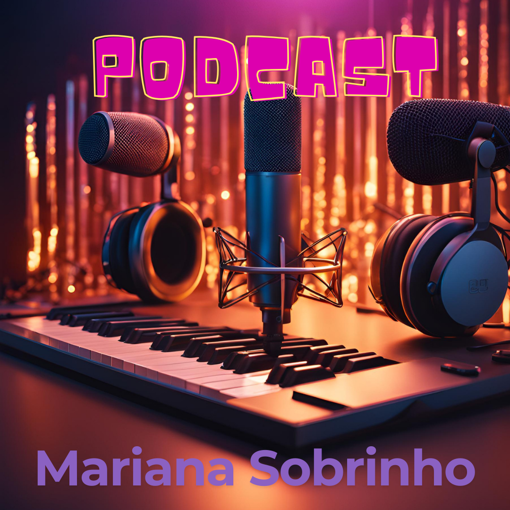

# Podcast-generate-by-ia---DIO---CEF

# Podcast Mariana Sobrinho

    <audio src="output/PodCastEditado.MP3 " controls title="Podcast editado"></audio>

# Projeto Podcast Gerado por I.A.s

Projeto com o objetivo de gerar um podcast utilizando ferramentas de IA através de prompts mais trabalhado.

## 💻 Tecnologias utilizadas no projeto

- [ChatGPT](https://chat.openai.com/)
- [Canva](https://www.canva.com/)
- [ElevenLabs](https://beta.elevenlabs.io/)
- [Capcut](https://www.capcut.com/pt-br/)

## ✨ Como foi feito ?

- Roteiro gerado via chatgpt
- Audio gerado pela elevenLabs
- Canva Para gerar capas
- Capcut para tratar aúdio e adicionar sons de fundo

## 👨‍💻 Expert

    
    
&nbsp&nbsp&nbspMariana Sobrinho 
    &nbsp&nbsp&nbsp
    <a 
        href="https://github.com/Magosobrinho">
        GitHub
    </a>
    &nbsp;|&nbsp;
    <a 
        href="https://www.linkedin.com/in/mariana-sobrinho-a6623b105/">
        LinkedIn
    </a>
 
  
   

  

---

feito com 💜 por Mariana Sobrinho
